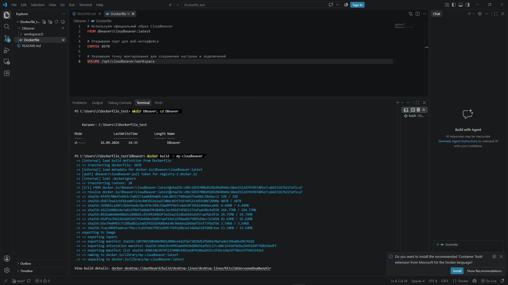
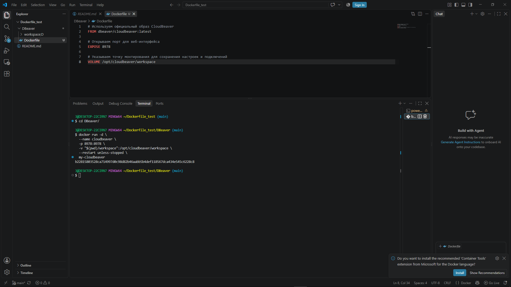
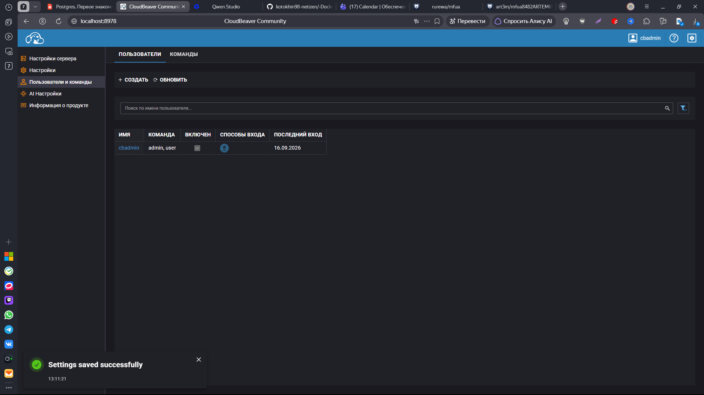
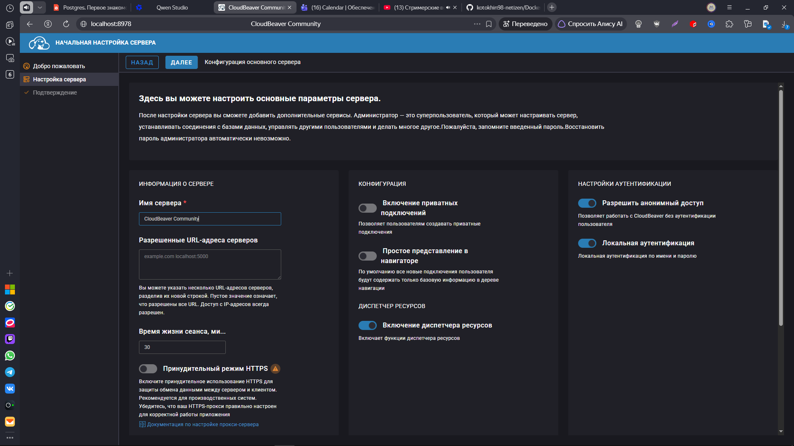

Вот адаптированная инструкция для запуска **CloudBeaver** с использованием `Dockerfile` и стандартных команд `docker` (без `docker compose`). Структура и стиль сохранены, а команды заменены на эквивалентные из базового CLI Docker.

---

## CloudBeaver (через Dockerfile)

**CloudBeaver** — это веб-версия популярного desktop-инструмента **DBeaver**.

### 1. Подготовка каталога
Создайте отдельный каталог для проекта и перейдите в него:
```shell
mkdir DBeaver && cd DBeaver
```

### 2. Создание Dockerfile
Создайте в каталоге `DBeaver` файл с именем `Dockerfile` (без расширения) следующим содержимым:

```dockerfile
# Используем официальный образ CloudBeaver
FROM dbeaver/cloudbeaver:latest

# Открываем порт для веб-интерфейса
EXPOSE 8978

# Указываем точку монтирования для сохранения настроек и подключений
VOLUME /opt/cloudbeaver/workspace
```



### 3. Сборка и запуск
Соберите собственный образ из созданного `Dockerfile`:
```shell
docker build -t my-cloudbeaver .
```

Запустите контейнер, привязав порт и локальную папку для сохранения данных:
```shell
docker run -d \
  --name cloudbeaver \
  -p 8978:8978 \
  -v "$(pwd)/workspace":/opt/cloudbeaver/workspace \
  --restart unless-stopped \
  my-cloudbeaver
```

[После этого откройте http://localhost:8978](http://localhost:8978) и начните работу. Все ваши подключения и настройки сохранятся в папке `./workspace` вашего хоста.

При первом запуске создайте новый сервер с именем администратора `cbadmin` и своим паролем > 8 символов, включая хотя бы одну прописную и строчную букву.

---



### 4. Управление контейнером

#### Состояние контейнера
Показать запущенные контейнеры:
```shell
docker ps
```
или все (в т.ч. остановленные):
```shell
docker ps -a
```

#### Логи
Просмотреть логи контейнера:
```shell
docker logs cloudbeaver
```
или в режиме ожидания (лучше запускать в отдельном терминале):
```shell
docker logs -f cloudbeaver
```

#### Остановка, запуск и перезапуск
Остановить контейнер:
```shell
docker stop cloudbeaver
```
Запустить остановленный контейнер:
```shell
docker start cloudbeaver
```
Перезапустить контейнер:
```shell
docker restart cloudbeaver
```

#### Конфигурация и вход
Показать подробную конфигурацию контейнера (аналог `docker compose config`):
```shell
docker inspect cloudbeaver
```
Вход в оболочку контейнера (исправлено с `mysql` на корректную оболочку CloudBeaver):
```shell
docker exec -it cloudbeaver /bin/bash
```
*(Если `/bin/bash` недоступен, попробуйте `/bin/sh`)*

Выйти из оболочки контейнера:
```shell
exit
```

---

### 5. Удаление проекта

1. Остановка и удаление контейнера (находясь в любой директории):
```shell
docker rm -f cloudbeaver
```
2. Удаление всех данных (папки `workspace`) – опционально:
```shell
rm -rf workspace
```
(**Будьте осторожны:** эта команда удалит все сохраненные подключения и настройки!).
3. Удалить собранный образ проекта:
```shell
docker image rm my-cloudbeaver
```
*(При желании можно также удалить базовый образ: `docker image rm dbeaver/cloudbeaver:latest`)*
4. Удалить каталог проекта:
Выходим из каталога проекта:
```shell
cd ..
```
и удаляем его:
```shell
rm -rf DBeaver
```
Если вы в Linux, для последних двух команд возможно придётся использовать `sudo`.

---

### Полезные ссылки
- [Официальная документация CloudBeaver для Docker](https://github.com/dbeaver/cloudbeaver/wiki/Docker)
- [Справочник команд Docker CLI](https://docs.docker.com/reference/cli/docker/)

> Если вы обнаружили ошибку в этом тексте - сообщите пожалуйста автору!

---

