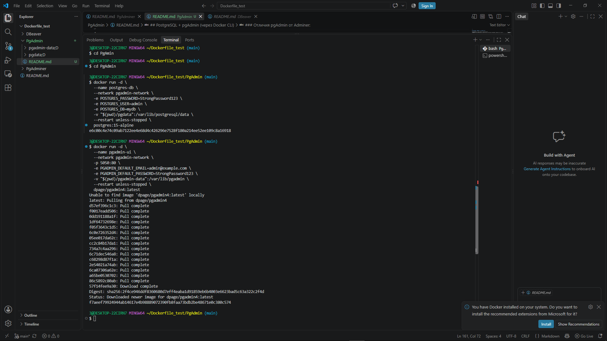
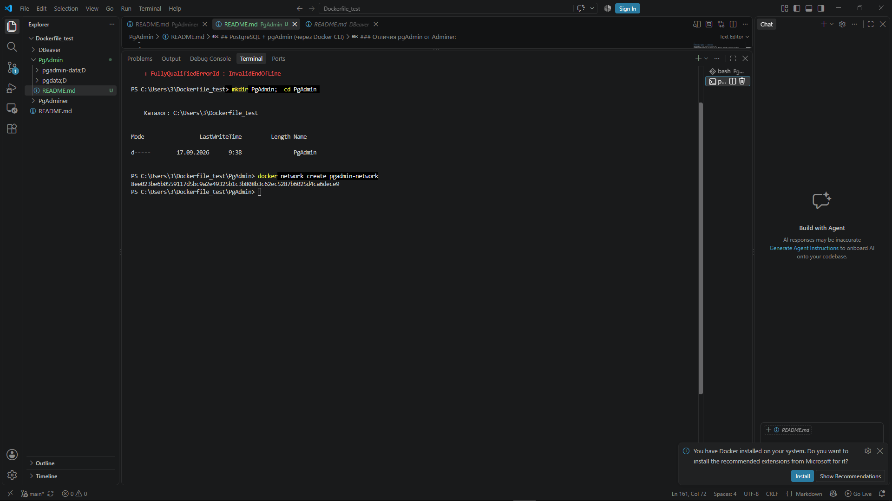
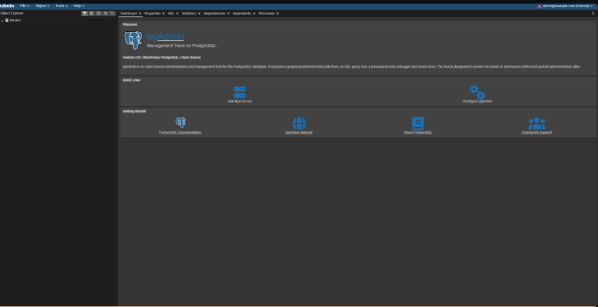
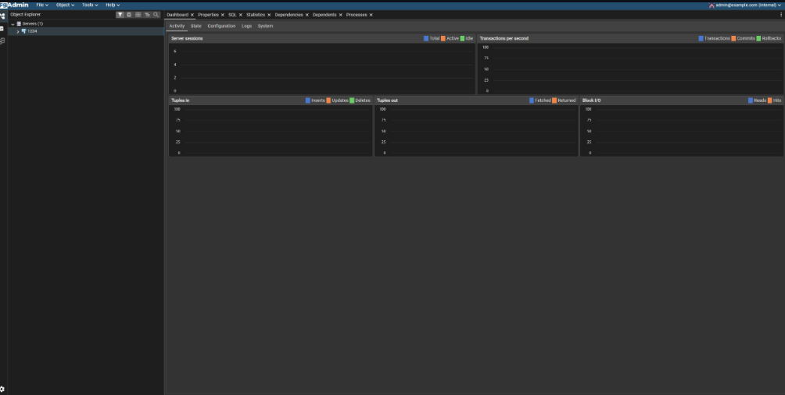

Вот адаптированная инструкция для запуска связки **PostgreSQL + pgAdmin**.

---

## PostgreSQL + pgAdmin (через Docker CLI)

**PostgreSQL** — мощная объектно-реляционная СУБД.  
**pgAdmin** — полнофункциональный веб-интерфейс для управления PostgreSQL (официальный инструмент).

### 1. Подготовка каталога
Создайте отдельный каталог для проекта и перейдите в него:
```shell
mkdir PgAdmin && cd PgAdmin
```

### 2. Создание сети
Создадим сеть для связи контейнеров:
```shell
docker network create pgadmin-network
```

### 3. Запуск базы данных (PostgreSQL)
Запустим контейнер с PostgreSQL:

```shell
docker run -d \
  --name postgres-db \
  --network pgadmin-network \
  -e POSTGRES_PASSWORD=StrongPassword123 \
  -e POSTGRES_USER=admin \
  -e POSTGRES_DB=mydb \
  -v "$(pwd)/pgdata":/var/lib/postgresql/data \
  --restart unless-stopped \
  postgres:15-alpine
```

### 4. Запуск интерфейса (pgAdmin)
Запустим pgAdmin с сохранением конфигурации:

```shell
docker run -d \
  --name pgadmin-ui \
  --network pgadmin-network \
  -p 5050:80 \
  -e PGADMIN_DEFAULT_EMAIL=admin@example.com \
  -e PGADMIN_DEFAULT_PASSWORD=StrongPassword123 \
  -v "$(pwd)/pgadmin-data":/var/lib/pgadmin \
  --restart unless-stopped \
  dpage/pgadmin4:latest
```




[Откройте в браузере http://localhost:5050](http://localhost:5050)

#### Первый вход в pgAdmin:
- **Email**: `admin@example.com`
- **Пароль**: `StrongPassword123`

#### Подключение к PostgreSQL в pgAdmin:
1. После входа нажмите правой кнопкой на **Servers** → **Register** → **Server**
2. Во вкладке **General**:
   - **Name**: `My PostgreSQL` (любое имя)
3. Во вкладке **Connection**:
   - **Host name/address**: `postgres-db` *(имя контейнера с БД)*
   - **Port**: `5432`
   - **Maintenance database**: `mydb`
   - **Username**: `admin`
   - **Password**: `StrongPassword123`
   - ✅ **Save password?** (поставьте галочку)
4. Нажмите **Save**

Теперь вы можете управлять базой данных через удобный интерфейс pgAdmin.




---

### 5. Управление контейнерами

#### Состояние контейнеров
Проверить работающие контейнеры:
```shell
docker ps
```

#### Логи
Логи PostgreSQL:
```shell
docker logs postgres-db
```
Логи pgAdmin:
```shell
docker logs pgadmin-ui
```
Режим реального времени:
```shell
docker logs -f pgadmin-ui
```

#### Остановка и запуск
Остановить оба контейнера:
```shell
docker stop postgres-db pgadmin-ui
```
Запустить снова:
```shell
docker start postgres-db pgadmin-ui
```
Перезапустить pgAdmin:
```shell
docker restart pgadmin-ui
```

#### Вход в консоль PostgreSQL
```shell
docker exec -it postgres-db psql -U admin -d mydb
```
Выход из консоли: `\q`

---

### 6. Удаление проекта

1. Остановка и удаление контейнеров:
```shell
docker rm -f postgres-db pgadmin-ui
```

2. Удаление сети:
```shell
docker network rm pgadmin-network
```

3. Удаление данных (опционально):
```shell
rm -rf pgdata pgadmin-data
```
(**Внимание!** Удалит все базы данных и настройки pgAdmin).

4. Удаление каталога проекта:
```shell
cd ..
rm -rf PgAdmin
```

---

### 7. Полезные ссылки
- [Официальная документация pgAdmin в Docker](https://www.pgadmin.org/docs/pgadmin4/latest/container_deployment.html)
- [Образ pgAdmin на Docker Hub](https://hub.docker.com/r/dpage/pgadmin4)
- [Образ PostgreSQL на Docker Hub](https://hub.docker.com/_/postgres)

---

### Отличия pgAdmin от Adminer:
| Характеристика | pgAdmin | Adminer |
|----------------|---------|---------|
| **Функционал** | Полноценный, профессиональный | Легковесный, базовый |
| **Интерфейс** | Сложный, много возможностей | Простой, минималистичный |
| **Ресурсы** | Требует больше памяти | Очень легкий |
| **Настройка** | Требует email и пароль | Простой вход |
| **Поддержка БД** | Только PostgreSQL | PostgreSQL, MySQL, SQLite и др. |

> Если вы обнаружили ошибку в этом тексте - сообщите пожалуйста автору!