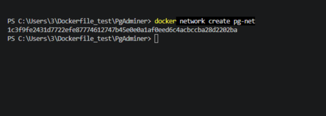
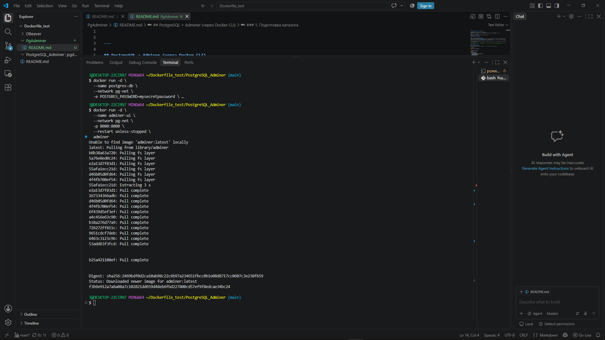
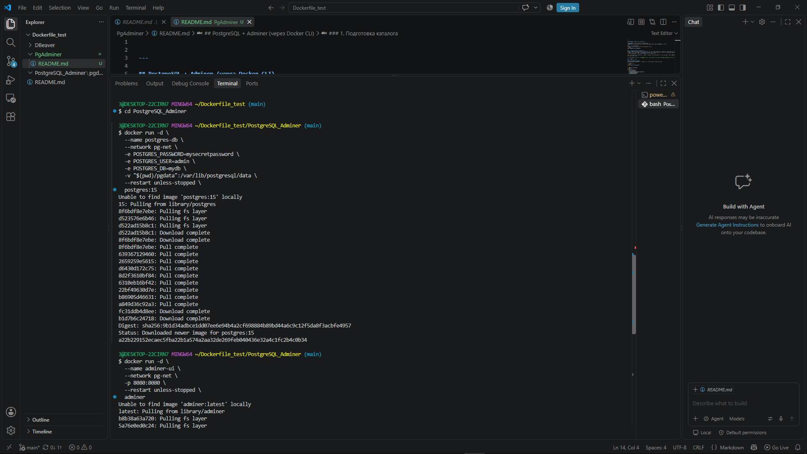
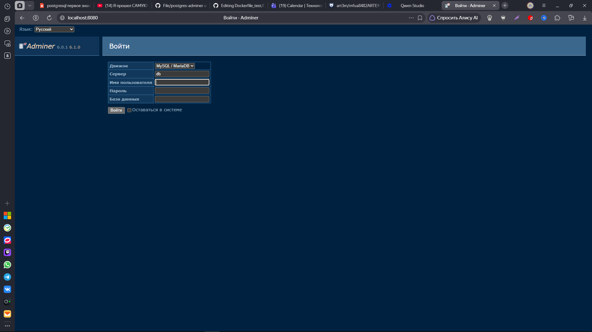
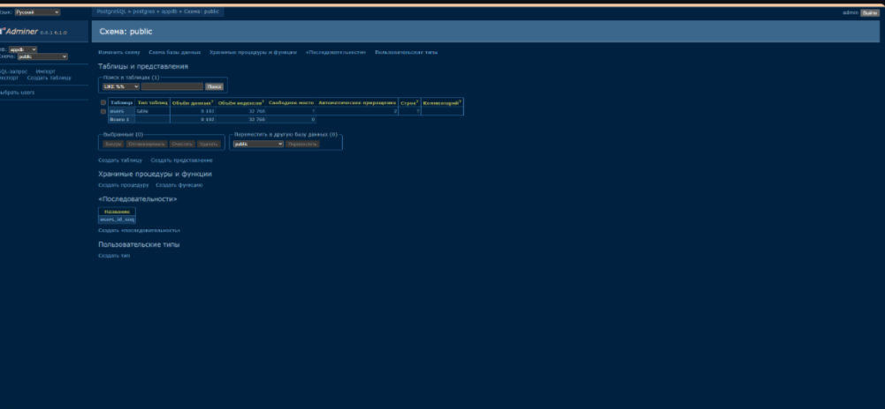

---

## PostgreSQL + Adminer (через Docker CLI)

**PostgreSQL** — мощная объектно-реляционная СУБД.  
**Adminer** — легкий веб-интерфейс для управления базами данных (аналог phpMyAdmin, но проще).

### 1. Подготовка каталога
Создайте отдельный каталог для проекта и перейдите в него:
```shell
mkdir PgAdminer && cd PgAdminer
```

### 2. Создание Dockerfile (опционально)
В данном случае нам не нужен сложный `Dockerfile`, так как мы будем использовать официальные образы напрямую. Однако, если вы хотите сохранить структуру, можно создать пустой `Dockerfile` или файл `.env` для переменных. Но для чистоты эксперимента, давайте обойдемся без сборки своего образа, а используем готовые образы, запуская их через `docker run`. 

Если вы настаиваете на `Dockerfile`, он будет тривиальным, поэтому пропустим этот шаг и перейдем сразу к запуску, так как это стандартная практика для таких связок в CLI.

> **Примечание:** В отличие от CloudBeaver, здесь мы не собираем свой образ, а используем официальные. Это быстрее и безопаснее.

### 3. Запуск сервисов

#### Шаг А: Запуск PostgreSQL
Сначала запустим базу данных. Мы создадим сеть, чтобы контейнеры видели друг друга.

1. Создаем сеть:
```shell
docker network create pg-net
```

2. Запускаем PostgreSQL:
```shell
docker run -d \
  --name postgres-db \
  --network pg-net \
  -e POSTGRES_PASSWORD=mysecretpassword \
  -e POSTGRES_USER=admin \
  -e POSTGRES_DB=mydb \
  -v "$(pwd)/pgdata":/var/lib/postgresql/data \
  --restart unless-stopped \
  postgres:15
```
*Замените `mysecretpassword` на сложный пароль.*

#### Шаг Б: Запуск Adminer
Теперь запускаем веб-интерфейс, который подключится к базе.

```shell
docker run -d \
  --name adminer-ui \
  --network pg-net \
  -p 8080:8080 \
  --restart unless-stopped \
  adminer
```

[После этого откройте http://localhost:8080](http://localhost:8080)

При входе в Adminer используйте следующие данные:
- **Система**: PostgreSQL
- **Сервер**: `postgres-db` (это имя контейнера с БД, они в одной сети)
- **Пользователь**: `admin`
- **Пароль**: `mysecretpassword` (тот, что указали при запуске postgres)
- **База данных**: `mydb`

Все данные базы сохранятся в папке `./pgdata` вашего хоста.

---




### 4. Управление контейнерами

#### Состояние контейнеров
Показать запущенные контейнеры:
```shell
docker ps
```
Вы должны увидеть два контейнера: `postgres-db` и `adminer-ui`.

#### Логи
Просмотреть логи PostgreSQL:
```shell
docker logs postgres-db
```
Просмотреть логи Adminer:
```shell
docker logs adminer-ui
```
Режим ожидания (follow):
```shell
docker logs -f postgres-db
```

#### Остановка, запуск и перезапуск
Остановить оба контейнера:
```shell
docker stop postgres-db adminer-ui
```
Запустить остановленные контейнеры:
```shell
docker start postgres-db adminer-ui
```
Перезапустить один из них:
```shell
docker restart adminer-ui
```

#### Вход в оболочку контейнера
Вход в контейнер с PostgreSQL (для выполнения SQL через psql):
```shell
docker exec -it postgres-db /bin/bash
```
Затем внутри контейнера можно подключиться к БД:
```shell
psql -U admin -d mydb
```
Выйти из psql: `\q`  
Выйти из bash: `exit`




---

### 5. Удаление проекта

1. Остановка и удаление контейнеров:
```shell
docker rm -f postgres-db adminer-ui
```

2. Удаление сети:
```shell
docker network rm pg-net
```

3. Удаление всех данных (папки `pgdata`) – опционально:
```shell
rm -rf pgdata
```
(**Будьте осторожны:** эта команда удалит все ваши базы данных!).

4. Удалить каталог проекта:
Выходим из каталога проекта:
```shell
cd ..
```
и удаляем его:
```shell
rm -rf PgAdminer
```

---

### Полезные ссылки
- [Образ PostgreSQL на Docker Hub](https://hub.docker.com/_/postgres)
- [Образ Adminer на Docker Hub](https://hub.docker.com/_/adminer)
- [Документация Docker Networks](https://docs.docker.com/network/)

> Если вы обнаружили ошибку в этом тексте - сообщите пожалуйста автору!