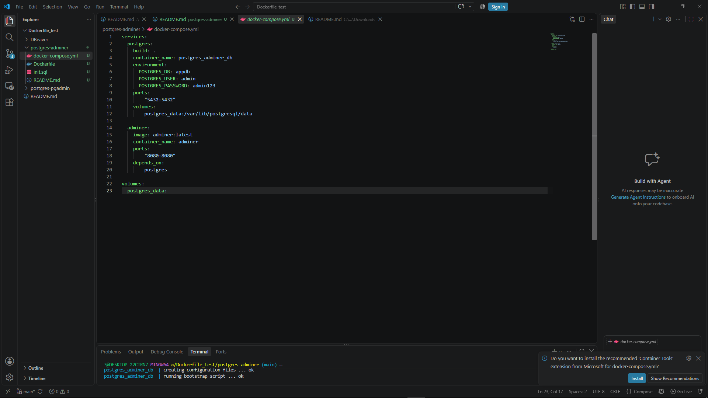
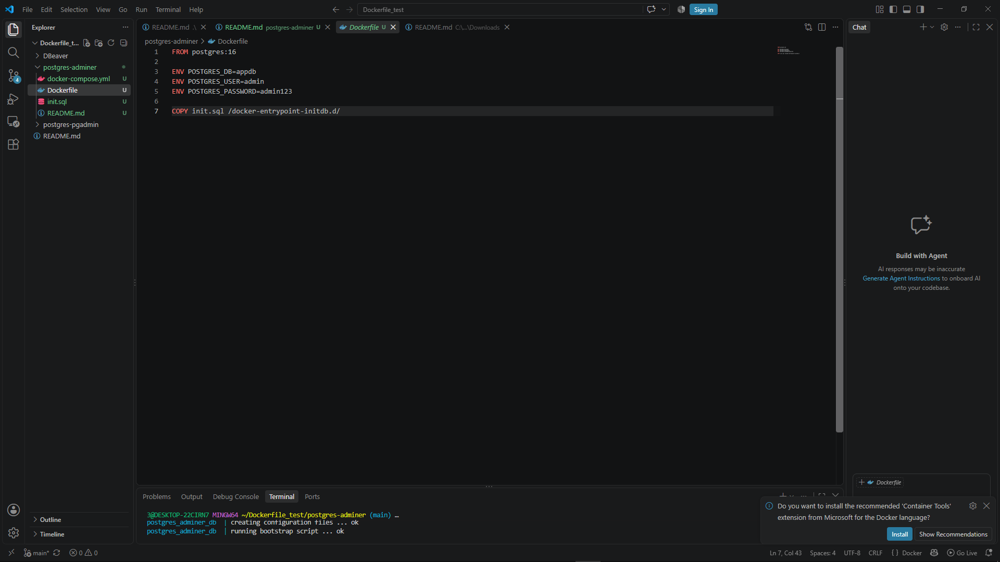
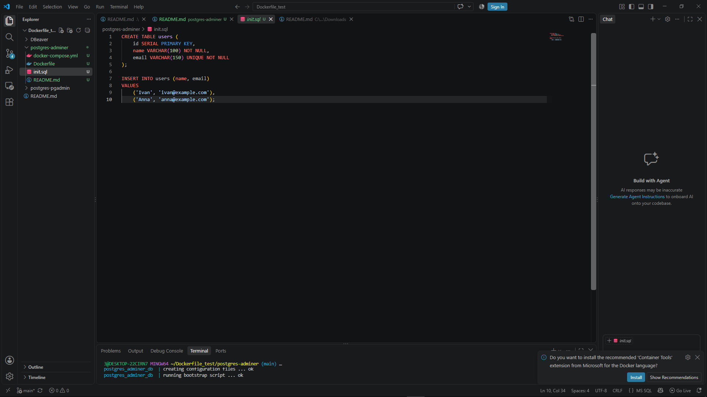
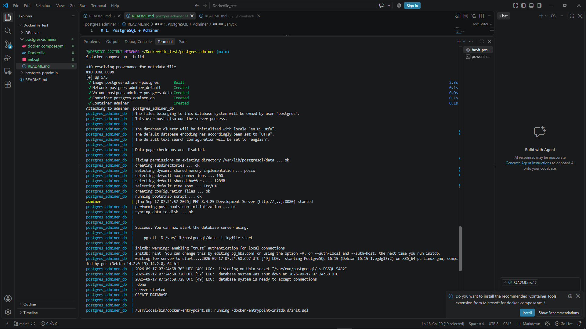
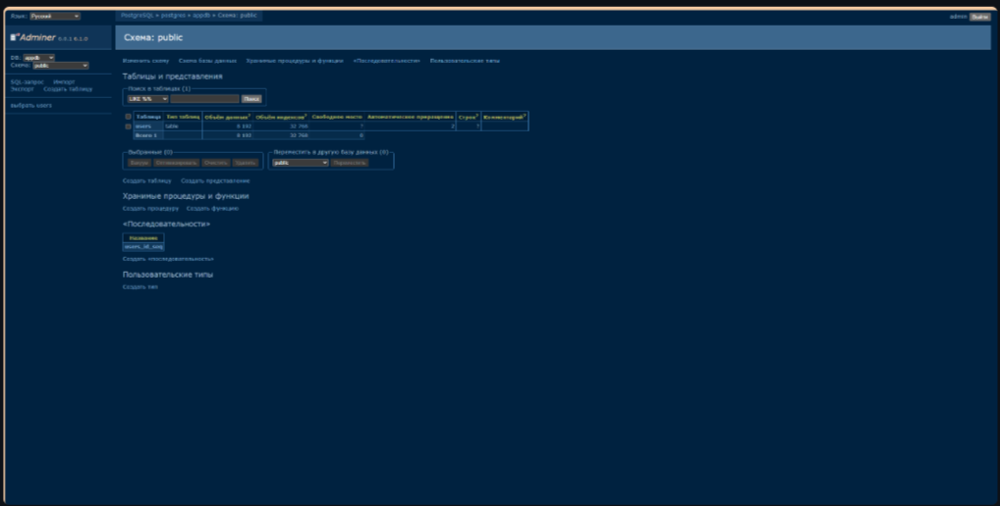

# 1. PostgreSQL + Adminer

## Структура проекта

```text
postgres-adminer/
├── Dockerfile
├── docker-compose.yml
└── init.sql
```




## Запуск

Перейти в директорию проекта:

```bash
cd postgres-adminer
```

Запустить контейнеры:

```bash
docker compose up --build
```

После запуска Adminer будет доступен по адресу:

```text
http://localhost:8080
```



## Данные для подключения

В Adminer необходимо указать:

| Параметр | Значение   |
| -------- | ---------- |
| System   | PostgreSQL |
| Server   | postgres   |
| Username | admin      |
| Password | admin123   |
| Database | appdb      |

---


