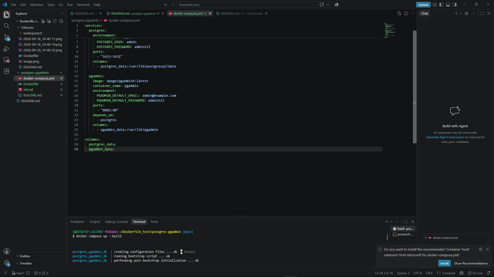
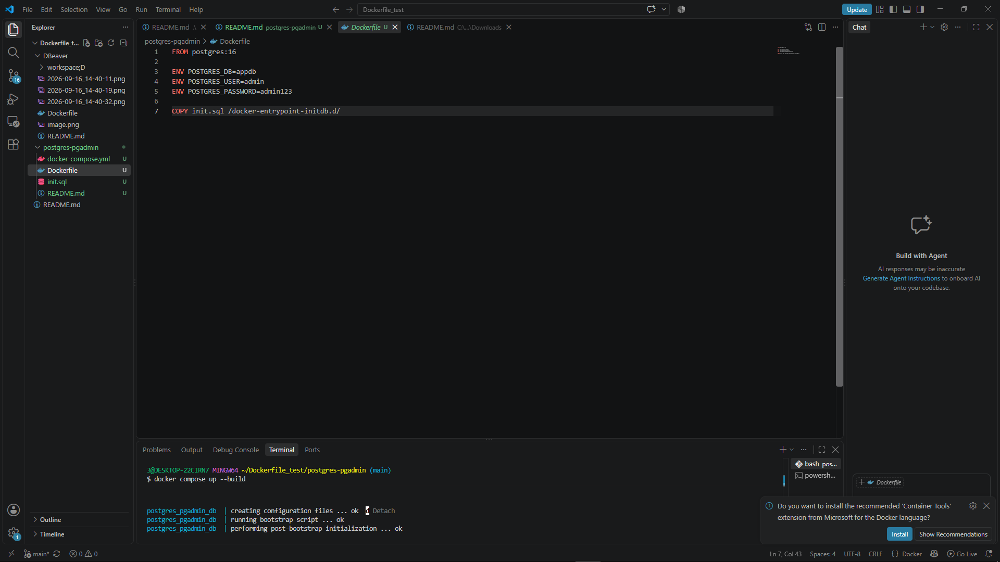
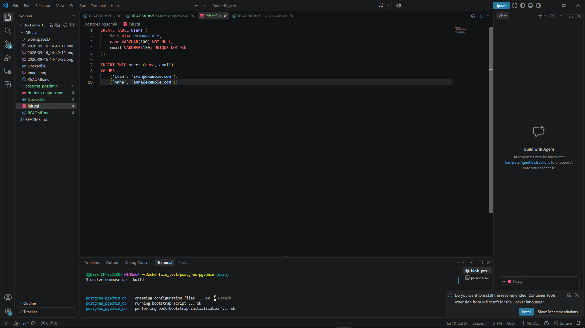
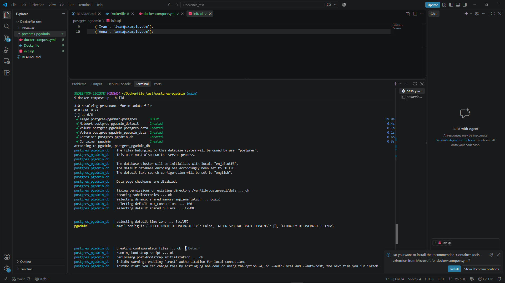
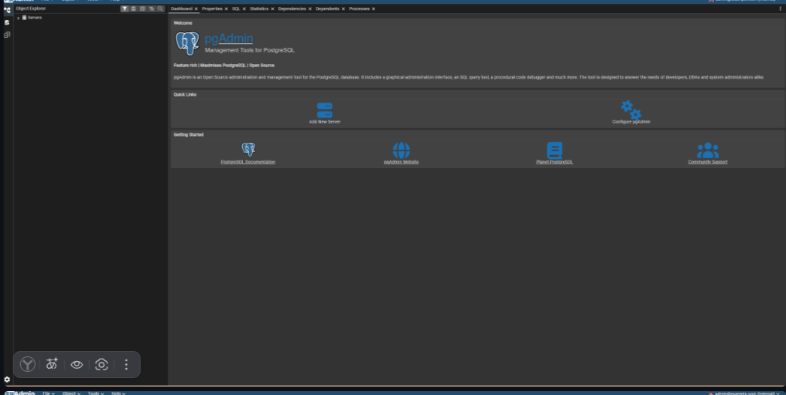
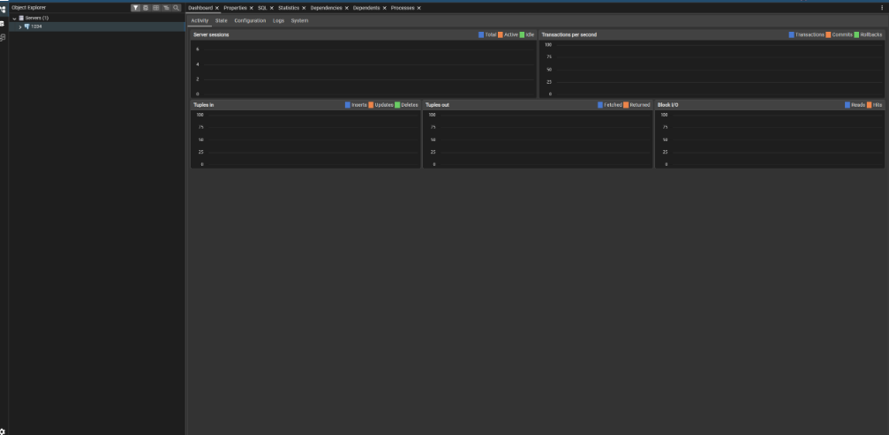

# 2. PostgreSQL + pgAdmin

## Структура проекта

```text
postgres-pgadmin/
├── Dockerfile
├── docker-compose.yml
└── init.sql
```





## Запуск

Перейти в директорию проекта:

```bash
cd postgres-pgadmin
```

Запустить контейнеры:

```bash
docker compose up --build
```

После запуска pgAdmin будет доступен по адресу:

```text
http://localhost:8081
```



## Вход в pgAdmin

Использовать следующие данные:

| Параметр | Значение                                      |
| -------- | --------------------------------------------- |
| Email    | [admin@example.com](mailto:admin@example.com) |
| Password | admin123                                      |

## Подключение PostgreSQL

После входа в pgAdmin необходимо создать подключение к PostgreSQL.

| Параметр | Значение |
| -------- | -------- |
| Host     | postgres |
| Port     | 5432     |
| Database | appdb    |
| Username | admin    |
| Password | admin123 |



